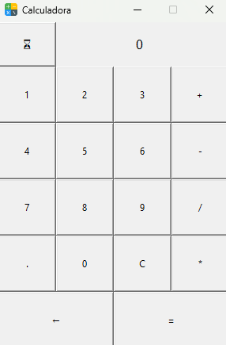
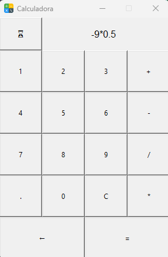
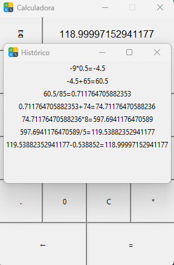

# Calculadora

## Objetivos e Escopo
O presente projeto tem por objetivo extender minha compreensão sobre a linguagem Python e suas ferramentas. Envolvendo o conceito de POO, bibliotecas de matemática e graficas.
A mesma será baseada na calculadora padrão do Windows 11, apresentando suas funções básicas e pequenas animações.

## Conhecimentos Desenvolvidos
- Python;
- POO;
- Tkinter (biblioteca gráfica);
- Operações com estruturas da linguagem;
- Funções built-in.

## Considerações
Durante o desenvolvimento me deparei com pequenos desafios envolvendo conversão de números para strings e vice-versa, algo que me possibilitou muito aprender sobre funções que trabalham com isso e percorrem estruturas na linguagem. 

Por ser uma calculadora básica, acabei não requisitando de bibliotecas matemáticas ou operações com matrizes. Entretanto, considero um grande aprendizado a experiência com a biblioteca gráfica Tkinter. Para o desenvolvimento da interface utilizei principalmente a função grid dela, algo que me proporcionou maior liberdade, porém achei uma biblioteca extremamente limitada, principalmente em comparação com outras ferramentas para interface as quais já tive contato. Vale ressaltar que ainda há muito a ser explorado da biblioteca e poderei voltar a utilizá-la no futuro, visto que não é ruim de toda forma. 

Por ser um projeto pequeno, creio ter sido extremamente proveitoso (e até divertido) me aventurar com a linguagem. Finalizo-o com um olhar positivo e em busca dos próximos!

# Imagens

